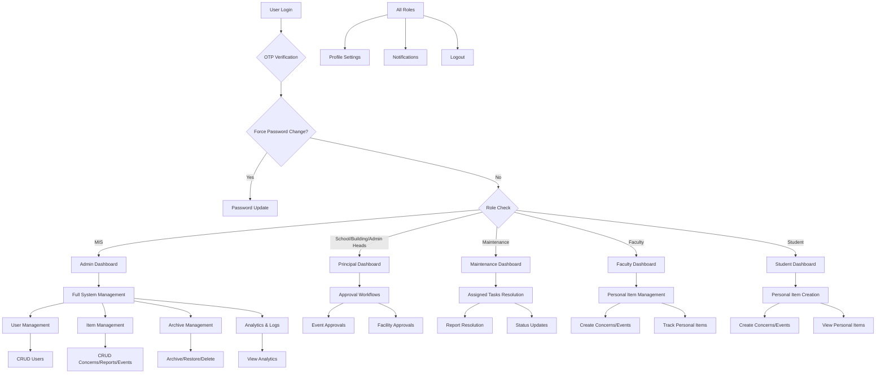
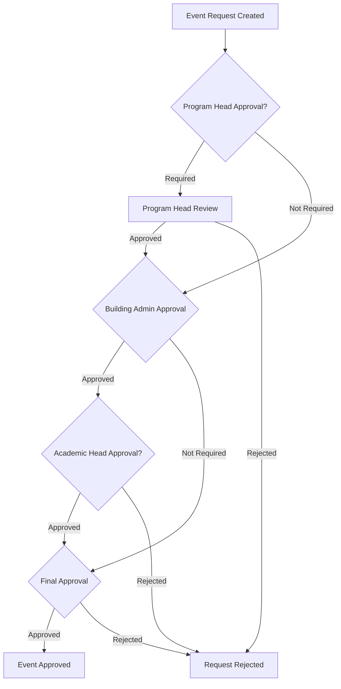

# Campfix System Flow and Functionalities by Role

## Overview
Campfix is a Laravel-based system for managing maintenance reports, concerns, event requests, and facility requests in an educational institution (STI Novaliches). It features role-based access control with multiple user types and comprehensive archiving/deletion systems.

## Authentication Flow

### Login Process
1. **User accesses login page** (`/`)
2. **Enters email and password**
3. **System validates:**
   - Email domain must be `@novaliches.sti.edu.ph`
   - Account not locked (OWASP A2 protection)
4. **If valid, generates OTP and logs out temporarily**
5. **User selects OTP delivery method:** Email or SMS
6. **OTP sent to chosen method**
7. **User verifies OTP**
8. **Redirects based on role:**
   - MIS (Admin): `/admin`
   - Others: `/dashboard`
9. **If first login:** Redirect to force password change

### Logout Process
1. **User clicks logout**
2. **Session invalidated and regenerated**
3. **Redirect to login page**

## User Roles and Functionalities

### 1. Student Role
**Default role for regular users**

#### Dashboard
- View personal concerns statistics
- List recent concerns

#### Functionalities
- **Create Concerns:** Submit maintenance issues
- **View Own Concerns:** Track status and details
- **Create Event Requests:** Request event facilities
- **Create Facility Requests:** Request facility usage
- **Profile Management:** Update personal info, password
- **Settings:** Theme, notifications, preferences

#### Restrictions
- Cannot view others' items
- Cannot approve or manage system-wide data

### 2. Faculty Role
**Similar to students with additional event tracking**

#### Dashboard
- View personal concerns
- View personal event requests
- Track pending events

#### Functionalities
- All student functionalities
- Enhanced event request management

### 3. Maintenance Role
**Handles physical repairs and maintenance tasks**

#### Dashboard
- View assigned reports (not concerns)
- Statistics: pending vs resolved reports

#### Functionalities
- **Update Report Status:** Mark reports as resolved, add resolution notes
- **Manage Assigned Reports:** Only reports assigned to them
- **View Report Details:** Photos, descriptions, locations
- **Add Resolution Details:** Cost, parts replaced

#### Restrictions
- Cannot create items
- Can only modify assigned items
- Cannot access admin areas

### 4. MIS (Management Information System) Role
**Super admin with full system access**

#### Dashboard
- System-wide statistics: total concerns, pending, resolved, urgent
- Recent concerns overview
- User management metrics

#### Functionalities
- **All Admin Functions:**
  - User Management: Create, edit, delete, archive, restore users
  - Concern Management: View all, assign, update status, archive, delete
  - Report Management: Similar to concerns
  - Event Request Management: Approve, reject, manage
  - Facility Request Management: Similar
- **Archive System:** Create folders, move items, restore, permanent delete
- **Deleted Items:** View, restore, permanent delete
- **Analytics:** Location-based repair analytics
- **Import/Export:** CSV user import, data export
- **Activity Logs:** System audit trail
- **Settings Management:** System-wide settings

### 5. School Admin Role
**High-level administrative approval**

#### Dashboard
- Pending event approvals
- Approved upcoming events
- Concern statistics

#### Functionalities
- **Approve Event Requests:** Multi-level approval system
- **View All Concerns:** System-wide visibility
- **Manage Events:** Within approval limits
- **Access Admin Areas:** Limited admin functions

### 6. Building Admin Role
**Building-specific administration**

#### Dashboard
- Similar to School Admin, building-focused

#### Functionalities
- **Approve Facility Requests:** Building-level approvals
- **Manage Building Items:** Concerns, reports for their building
- **Access Admin Functions:** Building-scoped

### 7. Academic Head Role
**Department-level academic oversight**

#### Dashboard
- Department-specific event approvals
- Concern overviews

#### Functionalities
- **Approve Events:** For their department
- **View Department Data:** Filtered by department

### 8. Program Head Role
**Program-specific management**

#### Dashboard
- Program-specific event approvals
- Filtered event statistics

#### Functionalities
- **Approve Events:** Program-level, department-filtered
- **Manage Program Events:** Within their scope

## Key Features Across Roles

### Concern Management
- **Create:** Students, Faculty
- **View:** Own (users), All (admins)
- **Update Status:** Maintenance (assigned), Admins
- **Assign:** Admins
- **Archive/Delete:** Admins only

### Report Management
- **Create:** Students, Faculty (reports vs concerns distinction unclear, but similar)
- **Resolve:** Maintenance (assigned)
- **Manage:** Admins

### Event Requests
- **Create:** Students, Faculty
- **Approve:** School Admin, Building Admin, Academic Head, Program Head (multi-level)
- **Manage:** Admins

### Facility Requests
- **Create:** Students, Faculty
- **Approve:** Building Admin, Admins
- **Manage:** Admins

### Archive System
- **Personal Archives:** All roles can archive their own items
- **Admin Archives:** MIS can create folders, archive any items
- **Role-specific Archives:** Separate archives for each role

### Notification System
- **Email/SMS Notifications:** For status changes, assignments
- **In-app Notifications:** Dashboard alerts

## Security Features
- **OTP Authentication:** 2FA via email/SMS
- **Account Lockout:** 5 failed attempts, 15 min lock
- **Rate Limiting:** API and form submissions
- **Input Sanitization:** XSS prevention
- **Role-based Access Control:** Middleware protection
- **Audit Logging:** All actions tracked

## Data Flow Diagram

### Step-by-Step Explanation of the Main System Flow

The flowchart below shows what happens from the moment a user logs in until they log out, based on their role in the system.

**Detailed Walkthrough:**

1. **User Login** → Everyone starts by logging into the system
2. **OTP Verification** → The system sends a one-time password (OTP) via email or SMS for security
3. **Force Password Change?** → If it's their first time or password needs updating, they must change it
4. **Role Check** → Based on their job/role, they get directed to different dashboards:
   - **MIS** (IT Admin) → Gets the main admin dashboard for full control
   - **School/Building/Admin Heads** → Gets a "principal" dashboard for approvals
   - **Maintenance Staff** → Dashboard showing repair jobs assigned to them
   - **Faculty** → Dashboard for teachers to manage their requests
   - **Students** → Basic dashboard for students

5. **What Each Role Can Do:**
   - **MIS (Full System Management):**
     - **User Management** → Create, read, update, delete users (CRUD)
     - **Item Management** → Manage all concerns, reports, events, facilities
     - **Archive Management** → Move items to archives, restore, or permanently delete
     - **Analytics & Logs** → View system statistics and activity logs

   - **Admin Heads (Approval Workflows):**
     - **Event Approvals** → Approve or reject event requests
     - **Facility Approvals** → Approve facility usage requests

   - **Maintenance (Assigned Tasks Resolution):**
     - **Report Resolution** → Fix and mark repair reports as completed
     - **Status Updates** → Change status of assigned maintenance jobs

   - **Faculty (Personal Item Management):**
     - **Create Concerns/Events** → Submit maintenance issues or event requests
     - **Track Personal Items** → Check status of their own submissions

   - **Students (Personal Item Creation):**
     - **Create Concerns/Events** → Submit basic requests
     - **View Personal Items** → See their own requests and status

6. **Common Features for All Roles:**
   - **Profile Settings** → Change password, phone, preferences
   - **Notifications** → Receive alerts about their requests
   - **Logout** → End the session securely

## Multi-level Approval System for Events

### How Event Requests Get Approved

Events need multiple levels of approval depending on the type and scope. Here's how the approval process works:

**Step-by-Step Approval Process:**

1. **Event Request Created** → Someone submits a request for an event (like a school activity)

2. **Program Head Approval Check:**
   - **If Required:** The request goes to the Program Head first
   - **Program Head Review:** They check if the event fits their program's needs
     - **Approved** → Moves to next step
     - **Rejected** → Request is denied, process stops

3. **Building Admin Approval:**
   - **If Required:** The Building Administrator reviews it
   - They check if the building/facilities are available
     - **Approved** → Moves to next step
     - **Rejected** → Request is denied

4. **Academic Head Approval Check:**
   - **If Required:** Goes to the Academic Head
   - **Academic Head Review:** They ensure it meets academic standards
     - **Approved** → Moves to final approval
     - **Rejected** → Request is denied

5. **Final Approval:**
   - Last check by higher management
     - **Approved** → Event is officially approved and can proceed
     - **Rejected** → Request is denied

**Why Multiple Approvals?**
- **Quality Control:** Each level ensures the event is appropriate and feasible
- **Resource Management:** Checks that facilities, budget, and schedules work
- **Safety & Compliance:** Makes sure events follow school rules and safety standards
- **Department Coordination:** Different heads ensure their areas aren't negatively impacted

This system ensures comprehensive management of campus maintenance and events with appropriate role-based access and security measures.